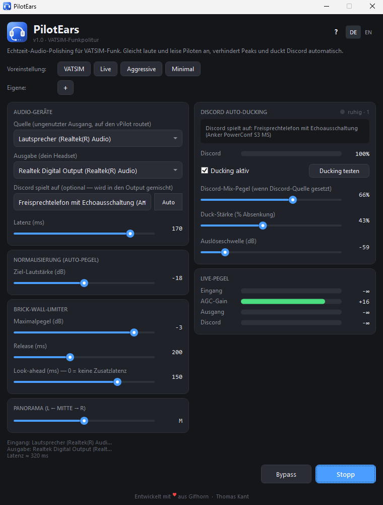

# PilotEars

**Echtzeit-Audio-Polishing für VATSIM vPilot / xPilot · Real-time audio polishing for VATSIM vPilot / xPilot**

[🇩🇪 Deutsch](#-deutsch) · [🇬🇧 English](#-english)



---

## 🇩🇪 Deutsch

PilotEars sitzt zwischen vPilot/xPilot und deinem Headset. Es gleicht leise und laute Piloten an, kappt plötzliche Peaks, kann ATC-Audio im Panorama platzieren und senkt Discord automatisch wenn ATC spricht — damit du auf VATSIM fliegen kannst ohne dass dir bei jedem Funkspruch das Trommelfell wegfliegt.

**Keine Treiber, keine virtuellen Kabel** — nutzt Windows WASAPI-Loopback.

### Features

- **Normalisierung (AGC)** — leise Piloten hoch, laute runter. Default-Ziel -18 dB (Broadcast-Standard).
- **Brick-Wall-Limiter** — Peak-Ceiling mit optionalem Look-ahead. Keine Knacker bei Schreiern.
- **Panorama** — ATC frei von links nach rechts platzieren.
- **Discord Auto-Ducking** — automatische Mechanik-Wahl: spielt Discord auf demselben Gerät wie der PilotEars-Ausgang, wird per-App-Volume gesenkt; auf separatem Gerät (z.B. Anker, Jabra, Yealink) wird der Geräte-Master gemutet/abgesenkt. Discord wird **niemals** in den PilotEars-Output gemischt — kein doppeltes Discord.
- **Live-Pegel-Anzeigen** — Eingang / AGC-Gain / Ausgang / Discord, 30 fps live.
- **Vier Presets + eigene** — VATSIM (empfohlen, Katie-Referenz-Werte), Live (Low-Latency), Aggressive, Minimal. Eigene speichern mit dem +-Knopf.
- **DE/EN** — komplett lokalisiert.

### Schnellstart

1. **Ungenutztes Render-Gerät identifizieren** in Windows-Sound — irgendein Gerät das du nicht aktiv hörst (Realtek Digital Output, ungenutztes HDMI, ausgeschalteter Bluetooth-Speaker).
2. **vPilot → Settings → Audio → Speaker Device** → dieses ungenutzte Gerät wählen.
3. **PilotEars starten.** Einstellen:
   - **Quelle** = das ungenutzte Gerät aus Schritt 1
   - **Ausgabe** = dein echtes Headset / Lautsprecher
   - **VATSIM**-Preset klicken
4. **Start klicken.** vPilot-Audio fließt jetzt normalisiert + limitiert in dein Headset.

Für Discord-Ducking: Discord öffnen, irgendein Sound abspielen, **„Auto"**-Knopf neben dem Discord-Quelle-Dropdown klicken. PilotEars erkennt Discords Gerät automatisch und konfiguriert das Ducking. Mit **„Ducking testen"** verifizierst du dass Discord hörbar leiser wird.

Der **„?"-Knopf** in der App öffnet einen ausführlichen Help-Dialog in DE/EN.

### Voraussetzungen

- Windows 10 / 11
- [.NET 8 Desktop Runtime](https://dotnet.microsoft.com/download/dotnet/8.0)
- vPilot oder xPilot
- Zwei verschiedene Audio-Render-Geräte

### Selbst kompilieren

```powershell
dotnet build -c Release
# oder Single-File-Publish:
dotnet publish -c Release -r win-x64 --self-contained false -p:PublishSingleFile=true
```

Output: `bin/Release/net8.0-windows/win-x64/publish/PilotEars.exe`

### Warum es das gibt

VATSIM-Funk ist ungefiltert. Piloten senden mit allem zwischen -40 dB (Geflüster) und voller Übersteuerung (Schreier). Bei jedem Funkspruch am Lautstärkeregler zu drehen ist nervig. PilotEars macht das automatisch während du fliegst.

Inspiriert von Katies *KatiePilot Audio Normaliser* (closed-source-Binary) — gleiche Problemdomäne, komplett eigene Implementierung, mit Zusatzfeatures (Discord-Ducking, Pan, Presets, Live-Meter, Lokalisierung).

### Lizenz

MIT — siehe [LICENSE](LICENSE).

---

## 🇬🇧 English

PilotEars sits between vPilot/xPilot and your headset. It normalises quiet and loud pilots to a consistent level, hard-caps sudden peaks, optionally pans the radio audio, and automatically ducks Discord when ATC is speaking — so you can fly on VATSIM with Discord open and never get blasted out of your chair.

**No drivers, no virtual cables** — uses Windows WASAPI loopback.

### Features

- **Normalizer (AGC)** — quiet pilots come up, loud ones come down. Target -18 dB by default (broadcast standard).
- **Brick-wall limiter** — peak ceiling with optional look-ahead. No clicks on screamers.
- **Pan** — place ATC anywhere from full-left to full-right.
- **Discord auto-ducking** — auto-picks the mechanic: if Discord plays on the same device as PilotEars's output, per-app Windows volume is ducked; if it plays on a separate device (e.g. Anker, Jabra, Yealink speakerphone), that device's master is muted/lowered. Discord audio is **never** mixed into PilotEars's output — no double Discord.
- **Live level meters** — input / AGC gain / output / Discord, all live at 30 fps.
- **Four presets + custom presets** — VATSIM (recommended, Katie reference values), Live (low-latency), Aggressive, Minimal. Save your own with the `+` button.
- **DE / EN** — fully localized.

### Quick start

1. **Pick an unused render device** in Windows Sound — any device you don't actively listen on (Realtek Digital Output, unused HDMI, off Bluetooth speaker).
2. **vPilot → Settings → Audio → Speaker Device** → pick that unused device.
3. **Launch PilotEars.** Set:
   - **Source** = the unused device from step 1
   - **Output** = your real headset / speakers
   - Click the **VATSIM** preset
4. **Click Start.** vPilot audio now flows through PilotEars into your headset, normalised and limited.

For Discord ducking: open Discord, play any sound, click the **Auto** button next to the Discord-source dropdown. PilotEars auto-detects Discord's device and configures ducking. Use the **Test ducking** button to verify Discord audibly drops.

The `?` button in the app opens a detailed help dialog in DE/EN.

### Requirements

- Windows 10 / 11
- [.NET 8 Desktop Runtime](https://dotnet.microsoft.com/download/dotnet/8.0)
- vPilot or xPilot
- Two distinct audio render devices

### Build from source

```powershell
dotnet build -c Release
# or for a single-file publish:
dotnet publish -c Release -r win-x64 --self-contained false -p:PublishSingleFile=true
```

Output: `bin/Release/net8.0-windows/win-x64/publish/PilotEars.exe`

### Why this exists

VATSIM radio is unfiltered. Pilots transmit anywhere from -40 dB (whispers) to peaking the digital ceiling (screamers). Chasing the volume slider every transmission is a chore. PilotEars does it automatically while you fly.

Inspired by Katie's *KatiePilot Audio Normaliser* (closed-source binary) — same problem domain, completely independent implementation, with additional features (Discord ducking, pan, presets, live meters, localization).

### License

MIT — see [LICENSE](LICENSE).

---

Entwickelt mit ♥ aus Gifhorn · Thomas Kant
